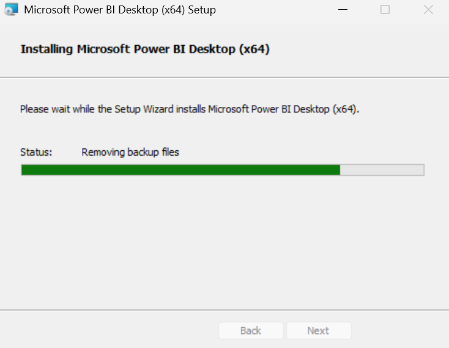
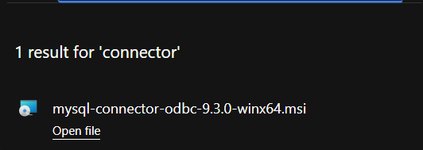
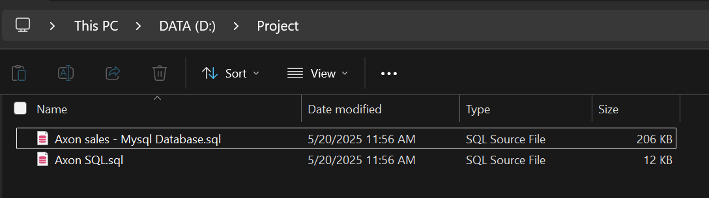
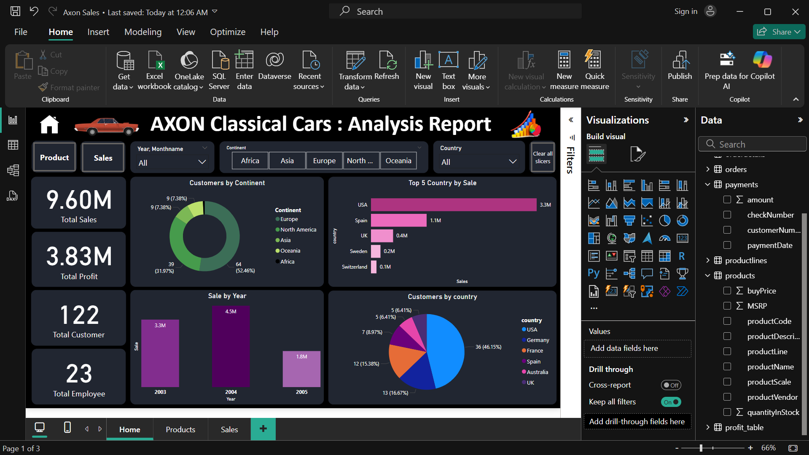

# LAPORAN WORKSHOP ADMINISTRASI JARINGAN

**Membuat Container System Sederhana**

**Dosen Pengampu:**
Dr. Ferry Astika Saputra ST, M.Sc

**Dikerjakan Oleh:**
Shalsabilla Wahyu Arifhana - 3123600014

**DEPARTEMEN TEKNIK INFORMATIKA**
**POLITEKNIK ELEKTRONIKA NEGERI SURABAYA**
**2024**

---

## Instalasi Aplikasi

### Power BI

  

**Analisis:**
Proses instalasi Power BI Desktop cukup sederhana dan dapat dilakukan langsung melalui situs resmi Microsoft atau Microsoft Store. Power BI menyediakan antarmuka yang user-friendly dan mendukung berbagai sumber data seperti Excel, SQL Server, maupun layanan cloud seperti Google Analytics dan Azure.

### Connector MySQL

  

**Analisis:**
Power BI tidak bisa langsung mengakses database MySQL tanpa adanya konektor (driver) tambahan yang disebut MySQL Connector/NET. Instalasi ini memungkinkan Power BI untuk mengenali MySQL sebagai salah satu sumber data eksternal. Setelah terinstal, pengguna dapat membuka Power BI Desktop, memilih opsi “Get Data”, lalu memilih “MySQL Database”. Jika konektor belum terdeteksi, Power BI akan menampilkan peringatan bahwa driver belum tersedia.

### Docker Desktop

  

**Analisis:**
Docker memungkinkan pengembang untuk membangun, menjalankan, dan mengelola aplikasi dalam wadah (container) yang ringan dan portabel. Proses instalasi Docker Desktop cukup mudah dilakukan pada sistem operasi Windows, macOS, maupun Linux, asalkan sistem memenuhi persyaratan minimum, seperti dukungan untuk virtualisasi.

---

## Buat Folder untuk File SQL yang Disediakan

  

**Analisis:**
File SQL dimasukkan ke dalam folder yang ada.

---

## Menjalankan Container MySQL dengan Docker

**Analisis:**
Perintah:

```bash
docker run --name axon-mysql -e MYSQL_ROOT_PASSWORD=123456 -p 3306:3306 -d mysql:5.7
```

digunakan untuk menjalankan container MySQL versi 5.7 dengan nama `axon-mysql`, password root `123456`, dan pemetaan port `3306`. Karena image `mysql:5.7` belum tersedia secara lokal, Docker akan otomatis mengunduh image tersebut dari Docker Hub.

---

## Salin File dari Komputer Lokal ke Dalam Container Docker

**Analisis:**
Gunakan perintah:

```bash
docker cp "Axon sales - Mysql Database.sql" axon-mysql:/axon.sql
```

Proses pemindahan file SQL ke dalam container akan berhasil jika nama file dan path-nya benar.

---

## Eksekusi Shell dalam Container dan Import Database MySQL

**Analisis:**
Masuk ke dalam container dengan:

```bash
docker exec -it axon-mysql bash
```

Lalu login ke MySQL:

```bash
mysql -u root -p
```

Setelah memasukkan password, buat database baru:

```sql
CREATE DATABASE classicmodels;
USE classicmodels;
```

---

## Membuat Database `classicmodels` dan Menampilkan Daftar Seluruh Database

**Analisis:**
Gunakan perintah:

```sql
SHOW databases;
```

Database `classicmodels` akan muncul bersama dengan database default lainnya seperti `information_schema`, `mysql`, `performance_schema`, dan `sys`.

---

## Import Model Database

**Analisis:**
Gunakan perintah:

```bash
mysql -u root -p classicmodels < /axon.sql
```

untuk mengimpor data ke dalam database `classicmodels`.

---

## Menampilkan Tabel yang Ada di Database

**Analisis:**
Setelah berada di dalam database `classicmodels`, gunakan perintah:

```sql
SHOW tables;
```

Akan muncul tabel-tabel seperti `customers`, `employees`, `offices`, `orderdetails`, `orders`, `payments`, `productlines`, dan `products`.

---

## Menampilkan Tabel untuk 5 Customer

**Analisis:**
Gunakan query berikut untuk menampilkan 5 data pelanggan:

```sql
SELECT * FROM customers LIMIT 5;
```

---

## Import Data BI ke Power BI untuk Visualisasi

  

**Analisis:**
Dashboard Power BI menampilkan analisis penjualan AXON Classical Cars secara visual. Total penjualan: 9,60 juta, profit: 3,83 juta, 122 pelanggan, dan 23 karyawan. Penjualan terbesar dari Amerika Serikat (3,3 juta), dengan tahun terbaik 2004 (4,5 juta). Pelanggan terbanyak dari Eropa (52,46%). Visualisasi ini membantu pengambilan keputusan strategis berbasis data.
