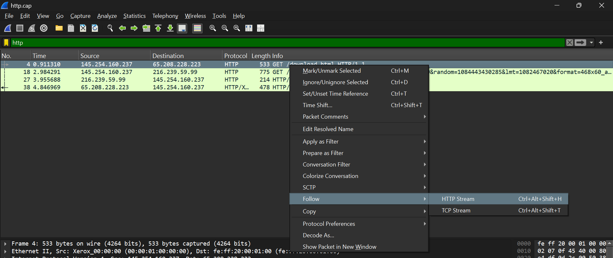
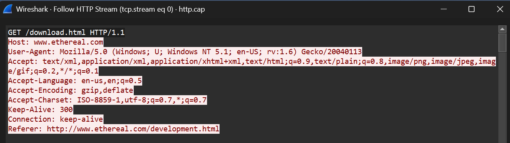
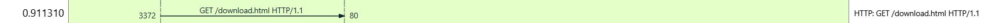
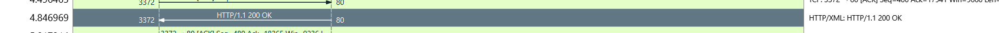
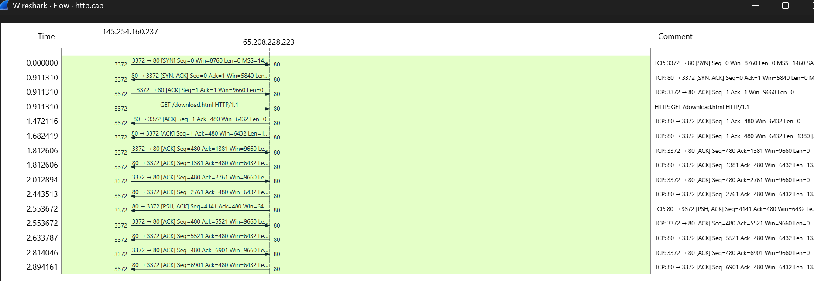
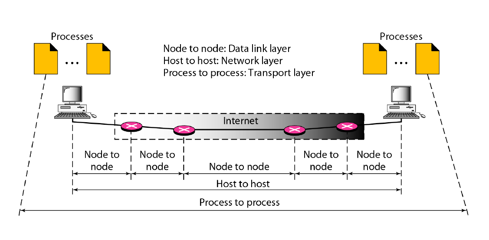

# LAPORAN WORKSHOP ADMINISTRASI JARINGAN

## Resume Wireshark

### Dosen Pengampu:
Dr Ferry Astika Saputra ST, M.Sc

### Dikerjakan Oleh:
- **Nama:** Shalsabilla Wahyu Arifhana  
- **Kelas:** 2 D4 Teknik Informatika A  
- **NRP:** 3123600014  

**DEPARTEMEN TEKNIK INFORMATIKA**  
**POLITEKNIK ELEKTRONIKA NEGERI SURABAYA**  
2024  

---
## **1. Analisa file http.cap dengan wireshark : Versi HTTP yang digunakan, IP address dari client maupun server, waktu dari client mengirimkan HTTP request., Waktu dari server mengirinmkan server dan berapa durasinya**

### Jawab:
Permintaan `GET /download.html HTTP/1.1` menunjukkan bahwa klien meminta file `download.html` dari server menggunakan metode `GET` dalam protokol `HTTP/1.1`.

**Langkah-langkah mengetahui jenis HTTP:**
1. Ketik **"HTTP"** pada kolom filter pencarian di bagian atas.
2. Cari protocol HTTP yang memiliki status tertentu, misalnya:
    
3. Klik kanan pada kolom tersebut, cari opsi **Follow** kemudian pilih **Follow HTTP Stream**.
   
4. Setelah klik **Follow HTTP Stream**, akan muncul informasi detail.
   

Berdasarkan gambar di atas ini, terlihat bahwa jenis protokol HTTP yang digunakan adalah **HTTP/1.1**.

#### **IP Address:**
- **Client:** `145.254.160.237`
- **Server:** `65.208.228.223`

#### **Durasi waktu server merespon:**
- **Waktu dari client mengirim request:** `0.911310`
  
- **Waktu dari server mengirimkan response:** `4.846969`
  
- **Waktu Respons:**
  
```math
Waktu Respons = Waktu 200 OK − Waktu GET
Waktu Respons = 4.846969 − 0.911310
Waktu Respons = 3.935659 detik
```

#### **Analisis:**
Waktu respons server adalah selisih antara waktu saat klien mengirim permintaan dan saat server memberikan respons. Berdasarkan gambar, klien mengirim GET request pada 0.911310 detik, sedangkan server merespons dengan 200 OK pada 4.846969 detik. Dengan demikian, waktu yang dibutuhkan server untuk merespons adalah 3.94 detik. Waktu respons ini bisa dipengaruhi oleh berbagai faktor, seperti kecepatan jaringan, beban server, dan ukuran data yang diminta. Jika waktu respons terlalu lama, kemungkinan ada bottleneck yang perlu dioptimalkan untuk meningkatkan performa sistem.

Waktu respons ini bisa dipengaruhi oleh berbagai faktor, seperti:
- Kecepatan jaringan
- Beban server
- Ukuran data yang diminta

##### **Melihat waktu melalui Flow Graph**
1. Pilih menu **Statistics** pada toolbar di atas.
2. Pilih **Flow Graph**.
3. Setelah berhasil membuka **Flow Graph**, akan muncul diagram komunikasi seperti di bawah ini:



4. Berikut adalah waktu GET


5. Berikut adalah waktu 200 OK


---

## **2. Deskripsi Gambar pada Slide**


### **Analisis Gambar:**
- Terdapat dua komputer di kedua ujung komunikasi yang berperan sebagai host.
- Data melewati beberapa router yang bertindak sebagai node dalam jaringan.
- Internet ditampilkan sebagai jaringan perantara yang menghubungkan berbagai node.
- Diagram ini menggambarkan bahwa komunikasi dimulai dari proses di satu komputer, dikirim melalui jaringan (melewati beberapa node), lalu diterima oleh proses di komputer tujuan.
  
### **Konsep Komunikasi Data dalam Jaringan**

#### **Model OSI (Tiga Lapisan Utama)**

#### **1. Lapisan Data Link (Node to Node)**
Lapisan ini mengatur komunikasi langsung antara dua perangkat yang saling terhubung, seperti komputer ke router atau antar router. Tugasnya memastikan data dapat dikirim dengan benar melalui media fisik dengan menangani pengalamatan MAC, deteksi kesalahan, dan kendali akses jaringan.

#### **2. Lapisan Network (Host to Host)**
Lapisan ini bertanggung jawab untuk mengirim data dari satu host ke host lainnya melalui beberapa node perantara, seperti router. Menggunakan alamat IP, lapisan ini menentukan jalur terbaik agar paket data bisa mencapai tujuan yang benar di jaringan yang lebih luas, termasuk internet.

#### **3. Lapisan Transport (Process to Process)**
Lapisan ini memastikan komunikasi antar aplikasi atau proses di dua komputer dapat berjalan dengan baik. Jika menggunakan protokol TCP, data dikirim dengan lebih andal karena ada mekanisme pengecekan dan pengulangan jika terjadi kesalahan. Jika menggunakan UDP, data dikirim lebih cepat tetapi tanpa jaminan sampai dengan sempurna.

---

### **3. Rangkuman Tahapan Komunikasi Menggunakan TCP**

#### **1. Connection Establishment**
TCP menggunakan Three-Way Handshake untuk memastikan koneksi dapat berjalan dengan baik.

Proses connection establishment : 
1. **SYN** → Klien mengirim permintaan koneksi ke server.
2. **SYN-ACK** → Server merespons dengan sinyal persetujuan.
3. **ACK** → Klien mengonfirmasi, dan koneksi siap digunakan.

#### **2. Data Transfer**
Data dikirim dalam bentuk segmen TCP. TCP memastikan pengurutan data, kontrol aliran (flow control) untuk mencegah overload, serta pendeteksian kesalahan dengan mekanisme ACK (Acknowledgment).

#### **3. Connection Termination**
Saat komunikasi selesai, koneksi TCP harus ditutup dengan mekanisme Four-Way Handshake untuk memastikan tidak ada data yang hilang atau terputus mendadak.

Prosesnya terdiri dari empat langkah utama:
1. **FIN** → Pengirim meminta mengakhiri koneksi.
   - Saat salah satu pihak (misalnya klien) ingin mengakhiri koneksi, ia mengirimkan FIN (Finish) ke pihak penerima.
   - Setelah ini, pengirim tidak akan mengirim data baru, tetapi masih bisa menerima data yang mungkin tertunda.
     
3. **ACK** → Penerima mengonfirmasi.
   - Pihak penerima mengirimkan ACK (Acknowledgment) sebagai tanda bahwa ia menerima permintaan FIN dari pengirim.
   - Namun, koneksi masih tetap terbuka jika penerima masih memiliki data yang harus dikirim.
     
5. **FIN** → Penerima juga meminta menutup koneksi.
   - Setelah memastikan semua data telah dikirim, penerima juga mengirimkan FIN untuk meminta menutup koneksi secara resmi.
   - Ini menandakan bahwa pihak penerima tidak akan mengirim lebih banyak data.
  
7. **ACK** → Pengirim mengonfirmasi, dan koneksi benar-benar ditutup.
   - Pengirim mengirimkan ACK terakhir sebagai tanda bahwa permintaan penutupan diterima.
   - Setelah ini, koneksi benar-benar ditutup dan kedua belah pihak tidak bisa lagi bertukar data.

---
