# LAPORAN ADMINISTRASI JARINGAN

**Dosen Pengampu:**  
Dr. Ferry Astika Saputra, S.T., M.Sc  

**Dikerjakan Oleh:**  
Shalsabilla Wahyu Arifhana - 3123600014  

**DEPARTEMEN TEKNIK INFORMATIKA**  
**POLITEKNIK ELEKTRONIKA NEGERI SURABAYA**  
2025  

---

## 1. Konfigurasi Internal Network  

### a. Instalasi bind9utils  
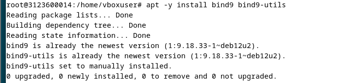  

### b. Menambahkan Internal Network dan External Network dalam `/etc/bind/named.conf`  
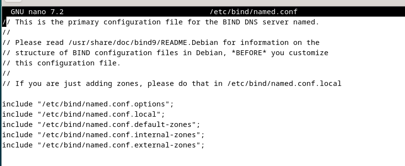  

### c. Atur ACL untuk Internal Network  
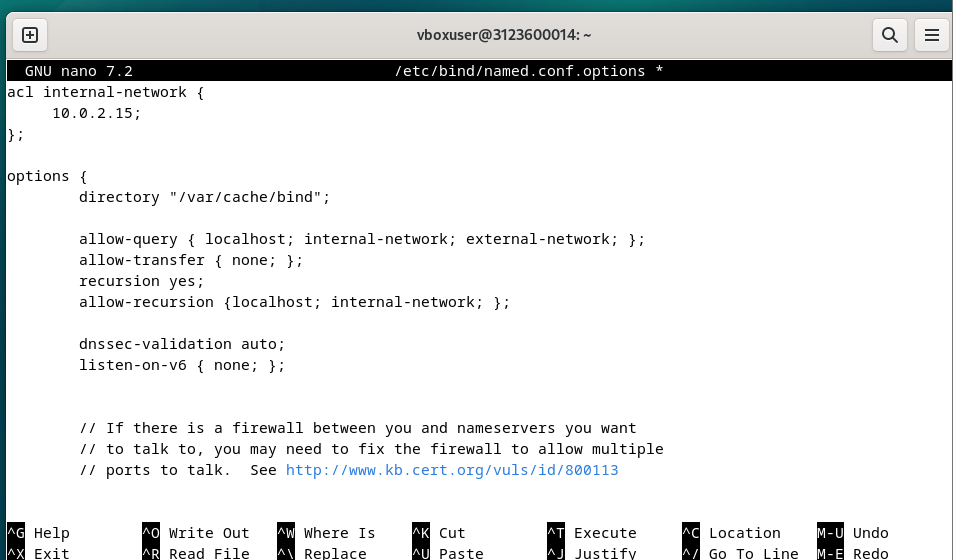  

### d. Atur Zona Internal  
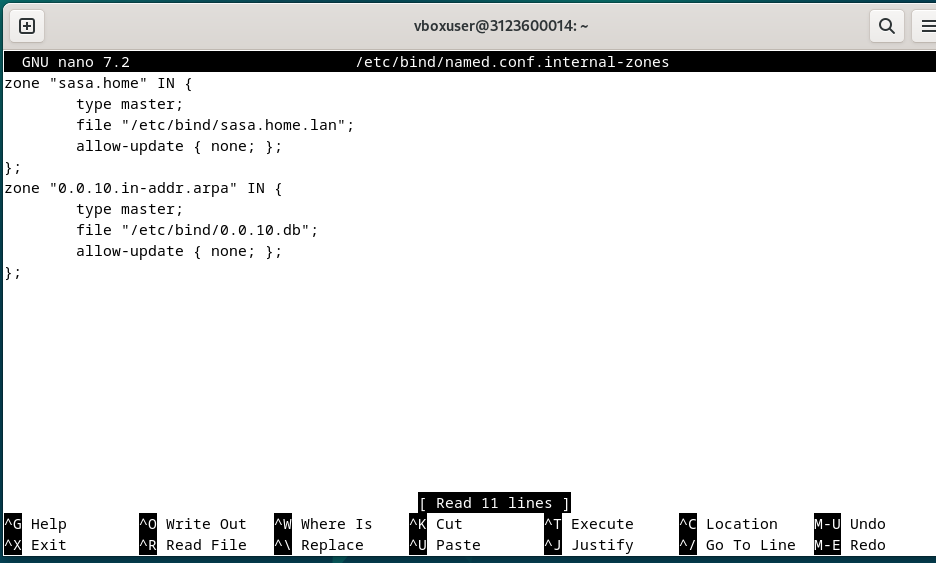  

### e. Mengatur `/etc/default/named` ketika perangkat mendukung IPv4  
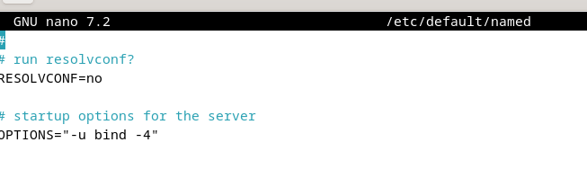  

---

## 2. Konfigurasi External Network  

### a. Menambahkan External Network dalam `/etc/bind/named.conf`  
  

### b. Atur ACL untuk External Network  
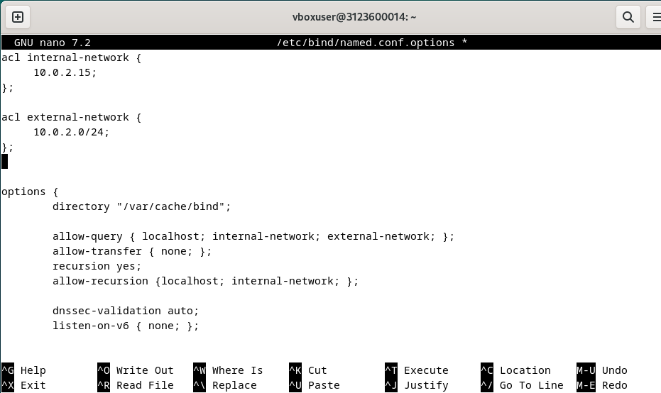  

### c. Atur Zona External  
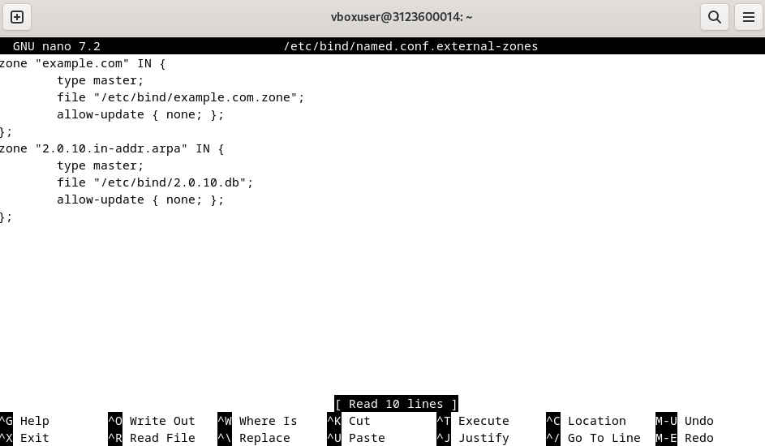  

---

## 3. Konfigurasi File Zona  

### a. Buat file zona yang digunakan oleh server untuk menerjemahkan alamat IP dari nama domain dan sebaliknya  
1. Setting file `/etc/bind/sasa.home.lan`

   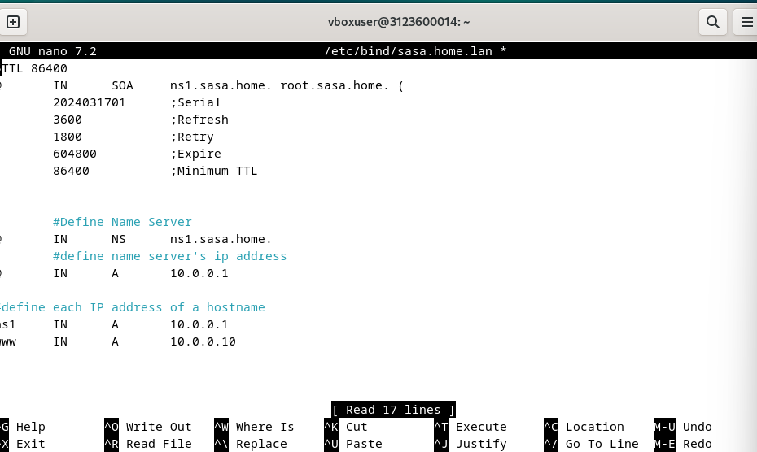  

2. Setting file `/etc/bind/example.com.zones`

   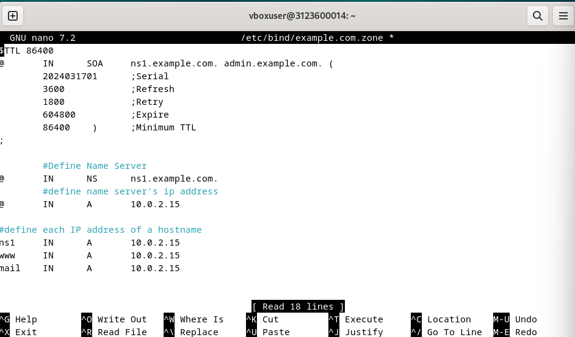  

### b. Buat file zona yang memungkinkan server menyelesaikan (menentukan) nama domain dari alamat IP dan sebaliknya  
1. Setting file `/etc/bind/0.0.10.db` untuk sasa.home

   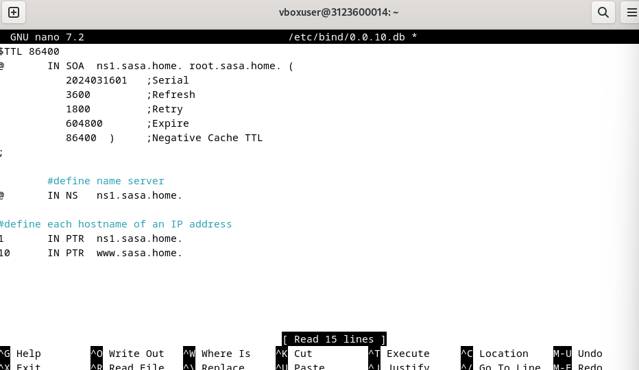  

2. Setting file `/etc/bind/2.0.10.db` untuk example.com

   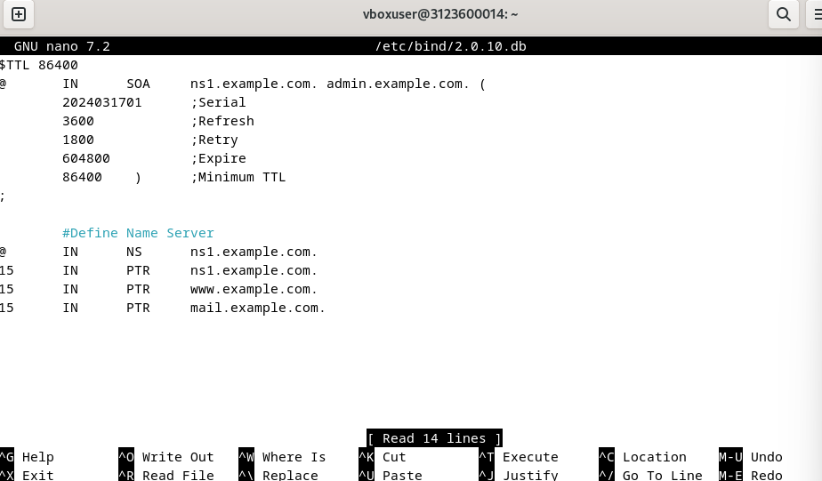  

---

## 4. Verifikasi  

### a. Restart BIND untuk menerapkan perubahan  

```bash
sudo systemctl restart bind9
```

### b. Jalankan perintah:  

Kemudian jalankan perintah : 
```bash
dig dlp.sasa.home
```
Perintah ini untuk mengetes sambungan dengan sasa.home

```bash
dig www.example.com @10.0.2.15
```

Perintah ini untuk menjalankan sambungan tes dengan external network
